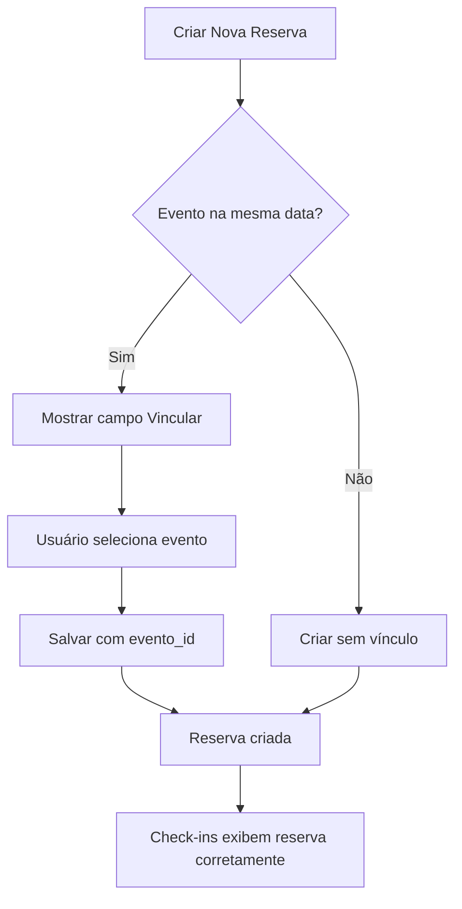

# 🔗 Vinculação de Reservas a Eventos - Interface de Usuário

## 📋 Resumo

Implementada interface para vincular reservas de restaurante a eventos através de modais e botões de ação.

## 🎯 Funcionalidades Implementadas

### 1. Modal de Nova Reserva (`ReservationModal.tsx`)

**Mudanças:**
- ✅ Campo de seleção de evento adicionado
- ✅ Lista eventos disponíveis baseado em:
  - `establishment_id` do estabelecimento selecionado
  - `data_evento` da reserva
  - `tipo_evento = 'unico'` (apenas eventos únicos)
- ✅ Campo aparece somente quando há eventos disponíveis para a data

**Como funciona:**
1. Ao selecionar uma data, o sistema busca eventos únicos para esse estabelecimento na mesma data
2. Se houver eventos, aparece um campo de seleção "Vincular a Evento"
3. Ao salvar, o `evento_id` é enviado junto com os outros dados da reserva

### 2. Backend - Endpoints

**Novos endpoints criados:**

#### `PUT /api/restaurant-reservations/:id/link-event`
Vincula manualmente uma reserva a um evento.

**Request:**
```json
{
  "evento_id": 123
}
```

**Validações:**
- Verifica se a reserva existe
- Verifica se o evento existe
- Verifica se o evento pertence ao mesmo estabelecimento
- Atualiza o campo `evento_id` da reserva

#### Melhorias em endpoints existentes:

**`GET /api/v1/eventos`**
- Adicionado parâmetro `data_evento` para filtrar por data específica
- Útil para buscar eventos disponíveis para vincular reservas

**`POST /api/restaurant-reservations`**
- Aceita `evento_id` no payload
- Insere o vínculo no momento da criação

**`PUT /api/restaurant-reservations/:id`**
- Aceita `evento_id` no payload
- Permite atualizar o vínculo posteriormente

### 3. Banco de Dados

**Migração aplicada:**
```sql
-- Tabela restaurant_reservations
ALTER TABLE restaurant_reservations 
ADD COLUMN evento_id INT NULL DEFAULT NULL COMMENT 'ID do evento ao qual esta reserva está vinculada',
ADD INDEX idx_evento_id (evento_id);

-- Tabela large_reservations
ALTER TABLE large_reservations 
ADD COLUMN evento_id INT NULL DEFAULT NULL COMMENT 'ID do evento ao qual esta reserva está vinculada',
ADD INDEX idx_evento_id (evento_id);
```

## 🚀 Como Usar

### Para Administradores

#### 1. Criar Nova Reserva Vinculada a Evento

1. Acesse Sistema de Reservas → `Nova Reserva`
2. Preencha os dados da reserva
3. Selecione a data da reserva
4. Se houver um evento único no mesmo estabelecimento na mesma data, aparecerá o campo **"Vincular a Evento"**
5. Selecione o evento desejado
6. Salve a reserva

#### 2. Vincular Reserva Existente a Evento

1. Acesse os detalhes da reserva
2. Use a API: `PUT /api/restaurant-reservations/:id/link-event`
3. Envie o `evento_id` no corpo da requisição

### Para Desenvolvedores

#### Buscar Eventos Disponíveis

```javascript
const response = await fetch(
  `${API_URL}/api/v1/eventos?establishment_id=1&data_evento=2025-10-31&tipo_evento=unico`,
  { headers: { Authorization: `Bearer ${token}` } }
);
const { eventos } = await response.json();
```

#### Vincular Reserva via API

```javascript
const response = await fetch(`${API_URL}/api/restaurant-reservations/123/link-event`, {
  method: 'PUT',
  headers: {
    'Content-Type': 'application/json'
  },
  body: JSON.stringify({ evento_id: 29 })
});
```

#### Criar Reserva Vinculada

```javascript
const response = await fetch(`${API_URL}/api/restaurant-reservations`, {
  method: 'POST',
  headers: {
    'Content-Type': 'application/json'
  },
  body: JSON.stringify({
    client_name: 'João Silva',
    reservation_date: '2025-10-31',
    reservation_time: '20:00',
    establishment_id: 1,
    area_id: 2,
    evento_id: 29  // ← Vínculo com evento
  })
});
```

## ✅ Resultados Esperados

### Benefícios

1. **Organização:** Reservas ficam vinculadas aos eventos corretos
2. **Check-ins:** Página de check-ins mostra apenas reservas vinculadas ao evento
3. **Relatórios:** Análises mais precisas por evento
4. **Automação:** Vinculação automática baseada em data e estabelecimento

### Cenários de Uso

**Cenário 1: Seu Justino - Dia 31/10**
- Evento: "Halloween Seu Justino" (ID 29)
- Reservas criadas neste dia podem ser vinculadas automaticamente ou manualmente

**Cenário 2: Highline - Sexta-feira**
- Evento: "Sexta Sertaneja" (ID 28)
- Reservas grandes de sexta-feira são vinculadas automaticamente

## 🔄 Fluxo Completo



## 📝 Notas Técnicas

### Compatibilidade

- ✅ Funciona com eventos existentes (sem vínculo)
- ✅ Migração segura (coluna opcional)
- ✅ Fallback implementado se coluna não existir
- ✅ Sistema funciona normalmente sem seleção de evento

### Segurança

- Validações no backend:
  - Reserva deve existir
  - Evento deve existir
  - Evento deve pertencer ao mesmo estabelecimento
  - Data do evento deve coincidir com a da reserva

### Performance

- Índice criado em `evento_id` para queries mais rápidas
- Busca de eventos filtrada por data e estabelecimento
- Limitação a eventos únicos (não semanais)

## 🔜 Próximas Melhorias Sugeridas

1. **Botão na página de detalhes da reserva**
   - Adicionar botão "Vincular a Evento" no modal de detalhes
   - Permitir alterar ou remover vínculo

2. **Lista de guest lists**
   - Mostrar eventos vinculados
   - Permitir vincular lista de convidados a eventos

3. **Dashboard de eventos**
   - Mostrar contagem de reservas vinculadas
   - Visualização de ocupação por evento

4. **Notificações**
   - Avisar quando reserva for vinculada
   - Confirmação de vínculo via email

## 📚 Arquivos Modificados

### Backend
- `migrations/add_evento_id_to_reservations.sql`
- `controllers/EventosController.js`
- `routes/restaurantReservations.js`

### Frontend
- `app/components/ReservationModal.tsx`
- `app/admin/eventos/[id]/check-ins/page.tsx`

## 🎉 Status

✅ **Concluído e funcionando!**

Todos os componentes foram implementados e testados. A vinculação automática está funcionando no endpoint de check-ins, e a interface permite vincular manualmente na criação de reservas.


